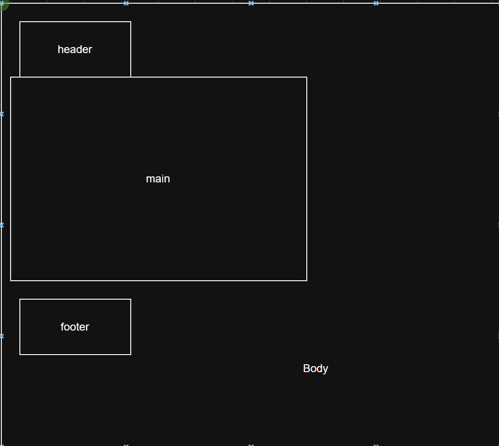

# Layout Rules
Tags describe “what this content is”, not “how it looks”.

# <header>
Use when:

Intro content for a page or section

Branding, logo, page heading

Can exist inside sections too

# <nav>
Use when:

The content is navigation

Primary or secondary menus

Links that move users around the site

# <section>
### If a block needs a heading to make sense, it’s a section.
Use <section> when:

The content represents a thematic group

It would make sense in a document outline

It has (or should have) a heading (h2, h3, etc.)

Examples:

About Me

Experience

Projects

Skills

Contact

# Best Practice
Each page should have one primary <h1> that represents the main topic of that page.

This is:

-Good for SEO

-Excellent for accessibility

-Clear for screen readers

-Easy for humans